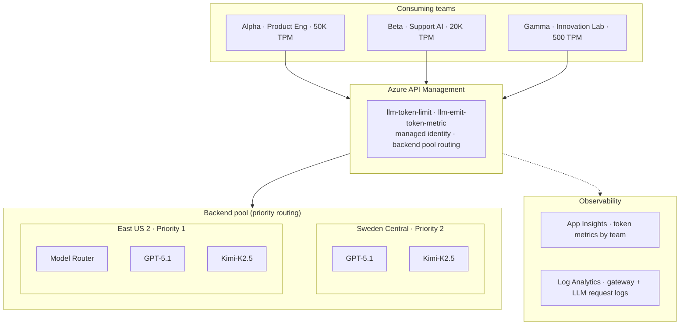
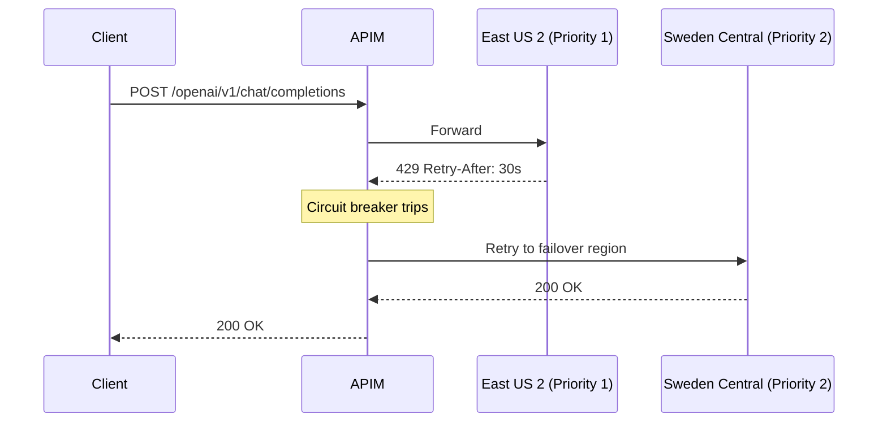
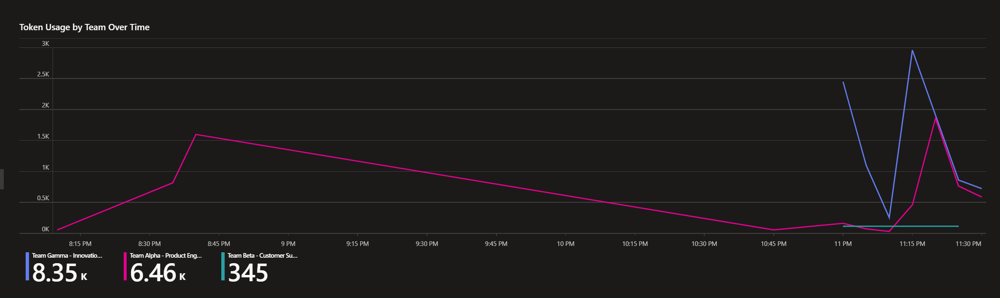
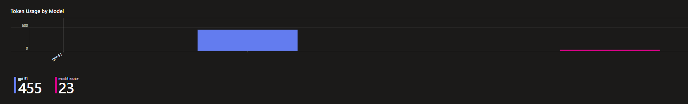
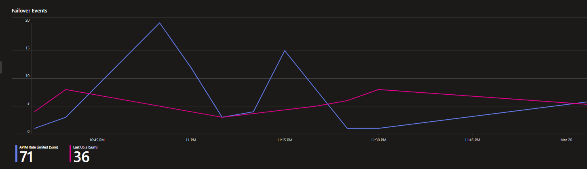

# Enterprise AI Gateway

> Provided diagrams, documents, and code are provided AS IS without warranty of any kind. MICROSOFT MAKES NO WARRANTIES, EXPRESS OR IMPLIED, IN THIS DOCUMENT OR CODE SAMPLE.

> This is a reference implementation for demo and architecture discussions, not production deployment. Validate all configurations against your own environment before production use.

## The scenario

Platform engineering teams need a single control plane for LLM traffic. They want to know which team consumed how many tokens on which model, enforce per-team quotas so the innovation lab doesn't starve production workloads, and fail over between regions without anyone noticing.

Microsoft has all the pieces. Azure API Management has AI gateway policies for token tracking and rate limiting. Microsoft Foundry hosts the models. App Insights collects the metrics. The individual [AI Gateway labs](https://github.com/Azure-Samples/AI-Gateway) each show one capability in isolation. This repo wires them together into the full enterprise story.

## What you get when you deploy this

- Token metrics flow to App Insights with team, model, and subscription dimensions. Run a KQL query, get a chargeback report.
- Three teams with different TPM quotas (50K, 20K, 500). Gamma hits 429 when they exceed theirs. Alpha doesn't.
- East US 2 is primary. When it runs out of quota, the circuit breaker reads the Retry-After header and routes to Sweden Central. Developers change nothing.
- GPT-5.1, Model Router, Kimi-K2.5 all route through `/openai/v1/chat/completions` with the standard `OpenAI()` SDK.
- MCP servers proxied through APIM with rate limits, logging, and read/write separation. API Center as the org-wide discovery surface.

## Architecture

Three teams hit one APIM gateway. APIM enforces quotas, emits token metrics, and routes to a backend pool across two Foundry regions. Circuit breakers handle failover.



When East US 2 returns 429, the circuit breaker trips (respects Retry-After) and routes to Sweden Central. Developers hit the same endpoint with the same key.

### Failover sequence



## Azure products used

| Product | What it does here |
|---------|------------------|
| [Azure API Management](https://learn.microsoft.com/en-us/azure/api-management/api-management-key-concepts) | Single entry point. Token quotas, chargeback metrics, backend pool routing, managed identity auth. |
| [AI Gateway in APIM](https://learn.microsoft.com/en-us/azure/api-management/genai-gateway-capabilities) | `llm-token-limit` and `llm-emit-token-metric` policies for token governance. |
| [Microsoft Foundry](https://learn.microsoft.com/en-us/azure/foundry/openai/api-version-lifecycle) | Hosts model deployments (GPT-5.1, Model Router, Kimi-K2.5). v1 unified API path. |
| [App Insights](https://learn.microsoft.com/en-us/azure/azure-monitor/app/app-insights-overview) | Token metrics with team/model/subscription dimensions for chargeback. |
| [Log Analytics](https://learn.microsoft.com/en-us/azure/azure-monitor/logs/log-analytics-overview) | Gateway logs and LLM request/response audit trail. |
| [API Center](https://learn.microsoft.com/en-us/azure/api-center/overview) | Unified tool/MCP discovery catalog across the org. |

## Teams

| Team | Persona | TPM quota | Models |
|------|---------|-----------|--------|
| Alpha | Product Engineering | 50,000 | GPT-5.1, Model Router |
| Beta | Customer Support AI | 20,000 | Model Router |
| Gamma | Innovation Lab | 500 | GPT-5.1, Kimi-K2.5 |

## Deploy it

See [docs/QUICKSTART.md](docs/QUICKSTART.md) for the full walkthrough. About 25 minutes from clone to first passing test.

```
terraform apply → 2 portal steps → post-deploy script → run tests
```

## Documentation

| Doc | Purpose |
|-----|---------|
| [QUICKSTART.md](docs/QUICKSTART.md) | Start here. Deploy to first test in ~25 min. |
| [ARCHITECTURE.md](docs/ARCHITECTURE.md) | Component details, observability layers, design decisions |
| [TROUBLESHOOTING.md](docs/TROUBLESHOOTING.md) | When things break |

## Teardown

```bash
cd infra/terraform && terraform destroy
```

## Dashboard

The `dashboards/queries.md` file has all the KQL queries used in these panels. Paste them into an Azure Monitor Workbook pointed at your App Insights resource to recreate this dashboard.

### Token usage by team


Pie chart breaks down total token consumption across all three teams. Gamma burns through tokens fast for an innovation lab with a 500 TPM quota.

### Token usage over time



Per-team token consumption over time. The spikes correspond to test3 (load test) and test5 (failover test) runs.

### Token usage by model



Shows which models are consuming tokens. The `Model` dimension is extracted from the request body by the APIM policy.

### Failover events



4xx errors split by region. "APIM Rate Limited" = requests rejected by `llm-token-limit` before reaching any backend. "East US 2" = backend 429s that triggered the circuit breaker.

### Cost estimation by team


Per-team cost estimate based on token consumption. The rates are placeholder ($0.01/1K input tokens) but the structure is there for real pricing.

## Coming next: centralized MCP governance

The `scripts/policies/mcp-governance.xml` policy is scaffolding for the MCP governance scenario. Enterprises register MCP servers (tool-use endpoints) through APIM the same way they register LLM endpoints. APIM becomes the single control plane for both model inference and tool execution.

What this will cover:

- MCP server registration: register an MCP-compatible server (e.g., a search tool, database connector, or internal API) as an APIM API with the MCP protocol
- Per-session rate limiting: `mcp-governance.xml` already differentiates between `tools/call` (write, 10/min) and `tools/list` (read, 60/min) based on the JSON-RPC method in the request body
- Correlation and audit: every MCP request gets an `X-Correlation-Id` header, logged alongside LLM requests in the same Log Analytics workspace
- API Center as the tool catalog: API Center (already deployed) becomes the discovery surface where teams find available MCP servers, their capabilities, and access policies
- Onboarding workflow: how a platform team registers a new MCP server, assigns it to products, and sets rate limits

This builds on top of the existing infrastructure. The APIM instance, monitoring, and product/subscription model are already in place. The MCP scenario adds a second API type alongside the Foundry AI Gateway.

Status: policy XML written, no backend MCP server deployed yet. See [MCP servers in APIM](https://learn.microsoft.com/en-us/azure/api-management/mcp-server-overview) for the platform capabilities.

Related files:

| File | Purpose |
|------|---------|
| `scripts/policies/mcp-governance.xml` | APIM policy for per-method rate limiting on MCP calls |
| `docs/MCP_ONBOARDING.md` | Guide for registering a new MCP server in APIM |
| `infra/terraform/modules/api-center/main.tf` | API Center, the unified tool discovery catalog |

## References

- [AI gateway capabilities in Azure API Management](https://learn.microsoft.com/en-us/azure/api-management/genai-gateway-capabilities)
- [GenAI gateway reference architecture (APIM-based)](https://learn.microsoft.com/en-us/ai/playbook/solutions/genai-gateway/reference-architectures/apim-based)
- [Import a Microsoft Foundry API into APIM](https://learn.microsoft.com/en-us/azure/api-management/azure-ai-foundry-api)
- [Azure OpenAI v1 API](https://learn.microsoft.com/en-us/azure/foundry/openai/api-version-lifecycle)
- [llm-emit-token-metric policy](https://learn.microsoft.com/en-us/azure/api-management/llm-emit-token-metric-policy)
- [llm-token-limit policy](https://learn.microsoft.com/en-us/azure/api-management/llm-token-limit-policy)
- [MCP servers in APIM](https://learn.microsoft.com/en-us/azure/api-management/mcp-server-overview)
- [Azure-Samples/AI-Gateway (individual labs)](https://github.com/Azure-Samples/AI-Gateway)

## License

MIT. See [LICENSE](LICENSE).
