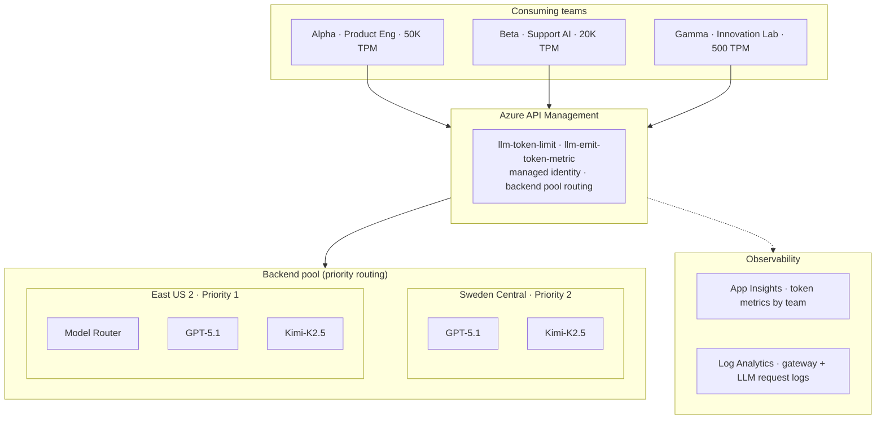
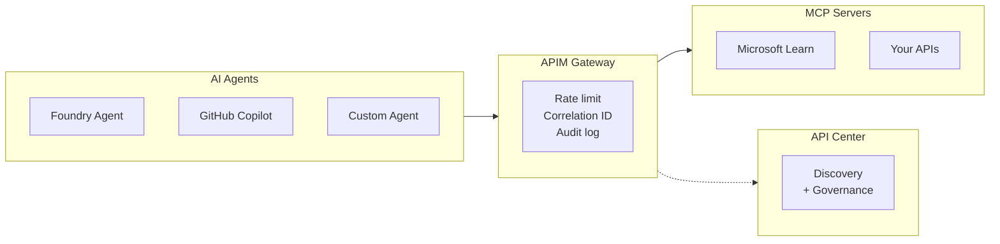
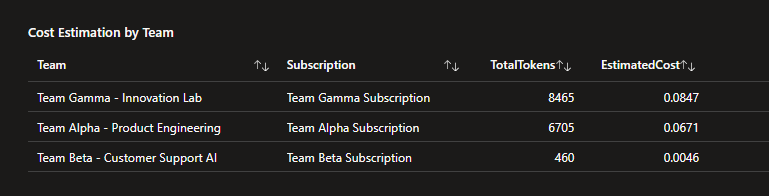
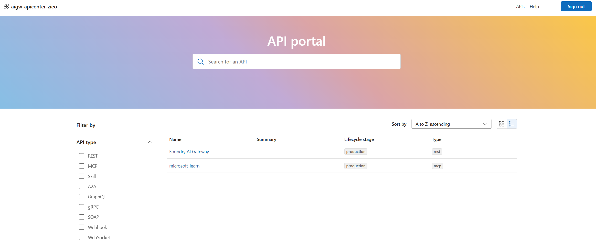

# Enterprise AI Gateway

Reference implementation: APIM as the control plane for LLM traffic and agent tool governance.

> Provided diagrams, documents, and code are provided AS IS without warranty of any kind. MICROSOFT MAKES NO WARRANTIES, EXPRESS OR IMPLIED, IN THIS DOCUMENT OR CODE SAMPLE. This is a reference implementation for demo and architecture discussions, not production deployment. Validate all configurations against your own environment before production use.

## The scenario

Enterprise AI platforms run into a common set of challenges:

- **Model availability:** Quota throttling, regional outages, one team starving another. Production workloads need reliable inference.
- **Cost visibility:** Which teams are consuming how many tokens, on which models, and what does it cost. Without this, AI spend is a black box.
- **Tool governance:** Agents calling whatever tools they want with no standards. No centralized catalog or rate limits. No audit trail.
- **Enforcement levers:** Your teams set the standards for how agents behave in production. They need infrastructure to enforce those standards: governed tool catalogs, rate limits per session, audit trails, and identity-scoped access.

The repo implements a working answer using APIM, Foundry, and API Center. Here's what it looks like when deployed:

**Rate limiting.** Per-team token quotas. Gamma's innovation lab gets 500 TPM. Alpha's production workload gets 50K. Same gateway, different limits. Gamma hits 429 when they exceed theirs. Alpha doesn't notice.

**Failover.** Circuit breaker reads the Retry-After header, routes to the failover region. Developers change nothing. Same endpoint, same key.

**Tool catalog.** MCP servers registered in APIM with rate limits, correlation IDs, and audit logs per call. Any agent (Foundry, Copilot, or custom) consumes governed tools through one URL. API Center is the discovery surface.

**Chargeback.** Token metrics flow to App Insights with team, model, and subscription dimensions. One KQL query gives you a chargeback report.

## Architecture

### LLM Gateway

Three teams hit one APIM gateway. APIM enforces quotas, emits token metrics, and routes to a backend pool across two Foundry regions. Circuit breakers handle failover.



### MCP Tool Governance

Agents consume governed MCP tools through the same gateway. Each method call gets its own rate limit, correlation ID, and audit log entry. API Center provides the discovery surface.



See [ARCHITECTURE.md](docs/ARCHITECTURE.md) for component details, failover sequence diagrams, and design decisions.

## Deploy it

See [QUICKSTART.md](docs/QUICKSTART.md) for the full walkthrough. ~25 min for the LLM gateway, ~40 min with MCP governance.

```
terraform apply → portal steps → post-deploy script → run tests
```

## What's included

| Component | What | Details |
|-----------|------|---------|
| `infra/terraform/` | Infrastructure as Code | APIM, Foundry (2 regions), App Insights, API Center |
| `scripts/` | Setup automation | Post-deploy config, MCP setup, API Center sync, env vars |
| `tests/` | Automated validation | 7 LLM gateway tests + 4 MCP governance + 4 MCP rate limit + Foundry agent test |
| `dashboards/` | KQL queries + workbook | Token chargeback, model usage, failover events |

## Dashboard

Token metrics, model usage, failover events, and cost estimation all flow into App Insights and Log Analytics. Import the workbook from `dashboards/` to recreate these panels.




See `dashboards/queries.md` for all KQL queries and additional dashboard panels.

## API Center

APIM APIs and MCP servers sync to API Center, giving teams a searchable catalog of every governed endpoint and tool across the org.



## Documentation

| Doc | Purpose |
|-----|---------|
| [QUICKSTART.md](docs/QUICKSTART.md) | Deploy to first test. Full walkthrough including MCP. |
| [ARCHITECTURE.md](docs/ARCHITECTURE.md) | Component details, failover sequences, design decisions |
| [TROUBLESHOOTING.md](docs/TROUBLESHOOTING.md) | When things break |
| [MCP_ONBOARDING.md](docs/MCP_ONBOARDING.md) | Three patterns for MCP server registration |
| [DEEP_DIVES.md](docs/DEEP_DIVES.md) | Individual capability labs from Azure-Samples |

## Teardown

```powershell
az group delete -n rg-ai-gateway-demo -y --no-wait
```

If redeploying with the same name prefix, purge the Foundry soft-deletes (names include your random suffix):

```powershell
az cognitiveservices account purge --name aigw-foundry-eus2-xxxx --resource-group rg-ai-gateway-demo --location eastus2
az cognitiveservices account purge --name aigw-foundry-swc-xxxx --resource-group rg-ai-gateway-demo --location swedencentral
```

## References

- [AI gateway capabilities in Azure API Management](https://learn.microsoft.com/en-us/azure/api-management/genai-gateway-capabilities)
- [GenAI gateway reference architecture (APIM-based)](https://learn.microsoft.com/en-us/ai/playbook/solutions/genai-gateway/reference-architectures/apim-based)
- [Import a Microsoft Foundry API into APIM](https://learn.microsoft.com/en-us/azure/api-management/azure-ai-foundry-api)
- [MCP servers in APIM](https://learn.microsoft.com/en-us/azure/api-management/mcp-server-overview)
- [Azure-Samples/AI-Gateway (individual labs)](https://github.com/Azure-Samples/AI-Gateway)

## License

MIT. See [LICENSE](LICENSE).
