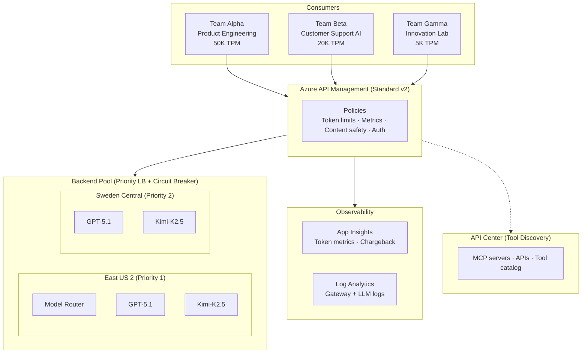
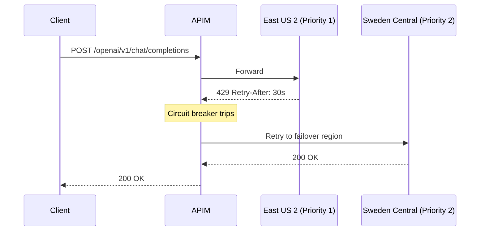

# Architecture

> **Setup:** See [QUICKSTART.md](QUICKSTART.md) for the deployment walkthrough.

## Overview

APIM Standard v2 in East US 2 is the single entry point for all LLM inference across the organization. Three teams (Product Engineering, Customer Support AI, and Innovation Lab) hit the same gateway with different quotas and subscription keys. Behind APIM, Microsoft Foundry backends in East US 2 (primary) and Sweden Central (failover) host the model deployments. A backend pool with priority-based load balancing and circuit breakers handles failover automatically when a region runs out of quota. App Insights captures per-request token metrics with team, model, and region dimensions, which feeds the chargeback reporting.

## Architecture diagram



## Components

| Component | Resource | SKU / Tier | Region | Purpose |
|-----------|----------|------------|--------|---------|
| API Gateway | Azure API Management | Standard v2 (1 unit) | East US 2 | Single entry point, policy enforcement, load balancing |
| Foundry (primary) | Cognitive Services (AIServices) | S0 | East US 2 | Model Router, GPT-5.1, Kimi-K2.5 (portal deploy) |
| Foundry (failover) | Cognitive Services (AIServices) | S0 | Sweden Central | GPT-5.1, Kimi-K2.5 (portal deploy, circuit breaker target) |
| Monitoring | App Insights + Log Analytics | Workspace-based | East US 2 | Token metrics, chargeback, LLM request/response logs |
| Identity | User-assigned managed identity | N/A | East US 2 | APIM authenticates to Foundry backends without API keys |
| Tool catalog | API Center | Standard (free with APIM) | East US 2 | Unified MCP/tool discovery for developers |

## Routing and failover

The backend pool uses priority-based load balancing. East US 2 backends sit at priority 1, Sweden Central at priority 2. Under normal conditions, all traffic goes to East US 2. Sweden Central only receives traffic when the primary region is unavailable or throttled.

Circuit breakers watch for 429 responses from Foundry backends. When a backend starts returning 429 (quota exceeded), the circuit trips and APIM stops sending traffic to it. The trip duration isn't hardcoded. APIM reads the `Retry-After` header from the 429 response and uses that value to decide how long to keep the circuit open. Recovery timing matches the backend's actual quota replenishment.

From a consumer's perspective, none of this is visible. They call the same APIM endpoint with the same subscription key regardless of which backend region handles the request. A quota spike in East US 2 doesn't produce errors. Traffic fails over transparently to Sweden Central.



## Teams

| Team | Persona | TPM quota | Models |
|------|---------|-----------|--------|
| Alpha | Product Engineering | 50,000 | GPT-5.1, Model Router |
| Beta | Customer Support AI | 20,000 | Model Router |
| Gamma | Innovation Lab | 500 | GPT-5.1, Kimi-K2.5 |

## Auth model

APIM authenticates to Foundry backends using a user-assigned managed identity with the Cognitive Services OpenAI User role assignment. No API keys are stored in APIM configuration or transmitted in backend requests.

Consumers authenticate to APIM using subscription keys, one per team. Each key is scoped to an APIM product that enforces team-specific token quotas and rate limits through policy.

## Token economics

Model Router charges its own token cost for the routing decision. This is small (billed per input token sent to the router) but it's a real line item that shows up in the metrics. Think of it as a dispatch fee.

The downstream model (GPT-5.1, Kimi-K2.5, etc.) is billed separately at that model's standard rate. Router tokens and model tokens are independent charges.

The `llm-emit-token-metric` APIM policy captures both costs. It emits custom metrics to App Insights with dimensions for team (subscription), API name, model name, and backend region. This is what makes per-team chargeback possible without any changes to the consuming applications.

## Unified tool catalog

```
┌─────────────────────────────────────────────────────┐
│                   API Center                         │
│            (Unified Discovery Catalog)               │
│  ┌──────────┐  ┌──────────┐  ┌──────────────────┐   │
│  │ APIM MCP │  │ Foundry  │  │ Partner/Custom   │   │
│  │ Servers  │  │ Tools    │  │ MCP Servers      │   │
│  └─────┬────┘  └─────┬────┘  └────────┬─────────┘   │
│        │ sync        │ sync           │ register     │
└────────┼─────────────┼────────────────┼──────────────┘
         │             │                │
         ▼             ▼                ▼
┌─────────────────────────────────────────────────────┐
│              APIM AI Gateway                         │
│        (Governed Execution Layer)                    │
└─────────────────────────────────────────────────────┘
```

Three registration paths feed into one catalog. APIM-native MCP servers sync automatically when configured in APIM. Foundry-managed tools (like grounding with Bing Search or Azure AI Search) sync from the Foundry project. Partner or custom MCP servers get registered directly in API Center.

All three paths route through APIM as the execution layer. Developers discover tools through API Center, but every invocation goes through APIM policies with the same auth, rate limiting, and logging as LLM inference.

### Phase 2: MCP Tool Governance

**MCP Tool Governance** extends the gateway's policy framework to cover tool invocations alongside LLM inference. Phase 2 introduces:

- Declarative policy definitions for tool invocation (request validation, response filtering)
- Tool-level quotas and rate limiting per consumer
- Audit trails for all tool calls
- Integration with API Center for policy discovery alongside tool metadata

This builds on the current single-API design and APIM catalog, adding governance primitives that apply to Foundry tools, APIM-managed APIs, and third-party MCP servers.

## API path

All traffic uses the v1 unified path: `/openai/v1/chat/completions`. The model is specified in the request body (`"model": "gpt-51"`), not in the URL. This means one API handles GPT-5.1, Model Router, Kimi-K2.5, and future models through the same endpoint.

Clients use the standard `OpenAI()` SDK (not `AzureOpenAI()`). No `api-version` parameter required.

```python
from openai import OpenAI

client = OpenAI(
    base_url="https://<your-apim>.azure-api.net/openai/v1",
    api_key="<apim-subscription-key>",
    default_headers={"api-key": "<apim-subscription-key>"}
)

response = client.chat.completions.create(
    model="gpt-51",
    messages=[{"role": "user", "content": "Hello"}],
    max_completion_tokens=100
)
```

The `default_headers` sends the APIM subscription key in the `api-key` header that APIM expects. The `api_key` parameter sets the `Authorization: Bearer` header as a fallback.

## Observability architecture

Three separate configurations must all be present for full telemetry. Missing any one silently breaks part of the pipeline.

| Layer | What it does | Created by | Target |
|-------|-------------|------------|--------|
| Azure Monitor diagnostic setting | Pipes raw logs from APIM to Log Analytics | Terraform | `GatewayLogs` and `GatewayLlmLogs` categories to dedicated tables |
| API-level `azuremonitor` diagnostic | Enables LLM log generation for the specific API | Post-deploy script | Makes `ApiManagementGatewayLlmLog` entries appear |
| API-level `applicationinsights` diagnostic | Routes `llm-emit-token-metric` output to App Insights | Post-deploy script | Makes `customMetrics` entries appear |

The diagnostic setting uses **Dedicated mode** (resource-specific tables). This gives clean column names (`BackendId` instead of `backendUrl_s`) and separate tables per log category.

Where to query what:

| Data | Resource | Table |
|------|----------|-------|
| Token chargeback metrics | Application Insights | `customMetrics` |
| LLM request/response logs (tokens, model, region) | Log Analytics workspace | `ApiManagementGatewayLlmLog` (singular) |
| Gateway traffic logs (status codes, latency, backends) | Log Analytics workspace | `ApiManagementGatewayLogs` |

See the `dashboards/queries.md` file for KQL queries and [TROUBLESHOOTING.md](TROUBLESHOOTING.md#observability-issues) for when things don't show up.

## Design decisions

| Decision | What we chose | Why |
|----------|--------------|-----|
| API path | v1 unified (`/openai/v1`) | One endpoint for all models. Standard `OpenAI()` SDK. No `api-version` parameter. |
| API import | "Azure OpenAI" compatibility | Creates `/openai` base path with v1 operations. "Azure AI" creates `/models` which requires `api-version` and breaks the v1 path. |
| API count | Single portal-imported API | Eliminates confusion between Terraform skeleton and portal import. All policies live on one API. |
| APIM tier | Standard v2 | Foundry AI Gateway compatible. VNet integration available. ~$700/mo. Credible for production conversations. |
| Regions | East US 2 + Sweden Central | Only regions where Model Router is available. Maximum Foundry feature coverage. |
| Multi-region APIM | Not used | v2 tiers don't support multi-region APIM deployment. Multi-region backends handle the failover story instead. |
| IaC | Terraform (azurerm + azapi) | Customer preference. Bicep available as secondary option. |
| Diagnostics | Dedicated mode, single setting | Resource-specific tables with clean column names. Both `GatewayLogs` and `GatewayLlmLogs` in one setting. |
| Foundry AI Gateway link | Portal-only manual step | No IaC support exists. Used as a demo strength in Part 6 ("The On-Ramp"). |
