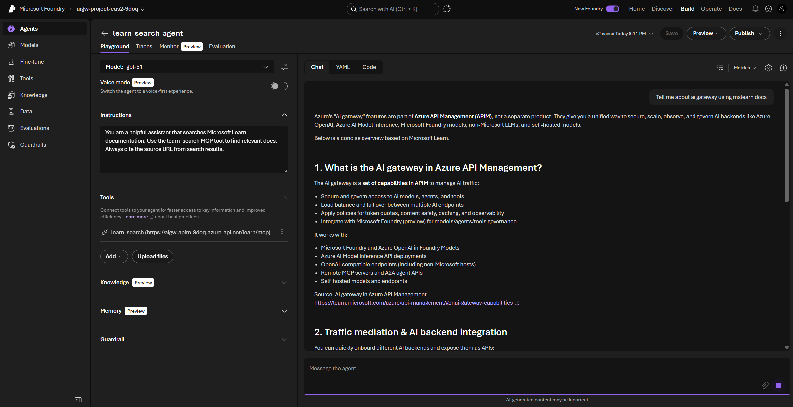
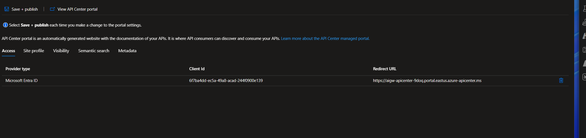
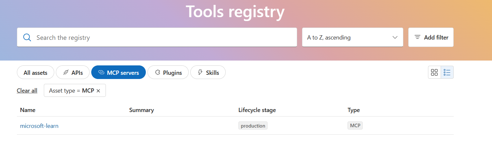
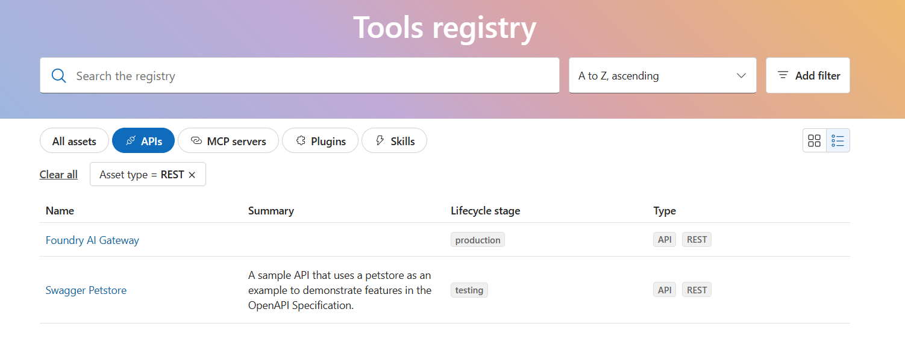

# Quickstart

Clone to first passing test in ~25 minutes. Full MCP governance in ~40 minutes.

## Prerequisites

| Tool | Version | Install |
|------|---------|---------|
| Terraform | >= 1.5 | `winget install Hashicorp.Terraform` |
| Azure CLI | Latest | `winget install Microsoft.AzureCLI` |
| Python | >= 3.10 | `winget install Python.Python.3.12` |
| PowerShell 7 | >= 7.0 | `winget install Microsoft.PowerShell` |
| apic-extension | Latest | `az extension add --name apic-extension --allow-preview true` |

> **PowerShell 7 required.** Scripts use PowerShell 7+ syntax. Check with `$PSVersionTable.PSVersion`. If you're on 5.x (Windows PowerShell), install 7 with `winget install Microsoft.PowerShell` and reopen your terminal as `pwsh`.

You need **Contributor** and **User Access Administrator** roles on the target subscription.

```powershell
az login
az account set --subscription "<your-subscription-id>"
```

---

## Phase 1: LLM Gateway (~25 min)

### Step 1: Deploy infrastructure (~15 min)

Provisions APIM, Foundry (2 regions), App Insights, API Center, and the MCP product via Terraform.

```powershell
cd infra/terraform
cp terraform.tfvars.example terraform.tfvars
# Edit terraform.tfvars — set subscription_id. MCP demo is enabled by default.
```

Deploy:

```powershell
terraform init
terraform plan -out deploy.tfplan
terraform apply deploy.tfplan
```

APIM Standard v2 is the bottleneck (5-10 min). Everything else finishes in 1-3 min.

If Terraform fails on model deployments, see [TROUBLESHOOTING.md](TROUBLESHOOTING.md#deploy-issues).

### Step 2: Deploy Kimi-K2.5 (optional, ~3 min)

Adds a third-party model to demonstrate multi-model routing through the same gateway.

Skip this if you only need GPT-5.1 and Model Router. Kimi demonstrates third-party model routing through the same gateway.

1. Go to [ai.azure.com](https://ai.azure.com) → find your primary Foundry project (e.g., `aigw-project-eus2-xxxx`)
2. From the project, go to **Model catalog** → search "Kimi-K2.5"
3. Deploy as Global Standard. Deployment name: `kimi-k25`
4. Repeat for the secondary project (e.g., `aigw-project-swc-xxxx`)

### Step 3: Import Foundry API in APIM (~2 min)

Connects APIM to your Foundry backends and enables the AI Gateway policy extensions.

This step enables `llm-*` policy extensions. No known CLI or IaC equivalent replicates what the portal wizard does.

1. Azure portal → navigate to resource group `rg-ai-gateway-demo`
2. Open your APIM instance (e.g., `aigw-apim-xxxx`) → APIs → **+ Add API**
3. Under "Create an AI API", click **Microsoft Foundry**
4. On the "Select AI Service" tab, pick your primary Foundry account (e.g., `aigw-foundry-eus2-xxxx`) from the `rg-ai-gateway-demo` resource group
5. On the "Configure API" tab, fill in:

   | Field | Value |
   |-------|-------|
   | Display name | `Foundry AI Gateway` |
   | Name | `foundry-ai-gateway` (auto-fills) |
   | Base path | `openai` |
   | Description | (optional) |
   | Products | Leave blank. The post-deploy script handles product associations |

5. Under **Client compatibility**, select **Azure OpenAI**. Do not select "Azure AI" (creates `/models` base path) or "Azure OpenAI v1" (doubles the path to `/openai/openai/v1`).
6. Skip the remaining tabs (token consumption, semantic caching, content safety). The post-deploy script configures these.
7. Click **Review** → **Create**

The wizard auto-configures system managed identity auth to the selected Foundry account. It creates deployment-based operations under `/openai`. The post-deploy script fixes the API path if the wizard doubled it, and adds a wildcard operation so v1 paths (`/openai/v1/chat/completions`) route correctly.

### Step 4: Run post-deploy script (~3 min)

Configures APIM policies, product associations, diagnostics, and RBAC that can't be done in Terraform.

```powershell
cd scripts
.\post-deploy.ps1
```

The script reads Terraform outputs and configures:
- Fixes the API path if the wizard doubled it (`openai/openai` to `openai`)
- Adds a wildcard POST operation for v1 path routing
- Associates the API with all three team products
- Configures API-level diagnostics (Azure Monitor LLM logs + App Insights metrics)
- Applies the API-level policy (token metrics, backend pool, managed identity auth)
- Upgrades product policies from rate-limit to `llm-token-limit`
- Exports a `.env` file and prints shell env commands

**Expected:** Each step prints ✓ in green. Script ends with "Post-deploy complete!"

### Step 5: Run Phase 1 tests (~2 min)

Validates connectivity, model routing, load handling, quota enforcement, failover, and observability.

```powershell
cd scripts
.\set_env.ps1
pip install -r ..\tests\requirements.txt
.\run_tests.ps1
```

Seven tests run in sequence:

| Test | What it checks |
|------|---------------|
| test1_connectivity | Basic APIM → Foundry round-trip |
| test2_model_router | Model Router resolves `gpt-51` |
| test3_load | Concurrent requests succeed |
| test4_quota | Token quota enforcement (Gamma 500 TPM) |
| test5_failover | Circuit breaker failover (may need `-SkipFailover`) |
| test6_metrics | App Insights `customMetrics` populated |
| test7_llm_logs | `ApiManagementGatewayLlmLog` entries appear |

Tests 6-7 poll with backoff because Log Analytics ingestion takes 2-10 min. If they time out on a fresh deploy, re-run after a few minutes.

### Step 6: See results

Confirms token metrics and request logs are flowing to App Insights and Log Analytics.

After tests pass, run these queries to confirm observability is working.

**Chargeback metrics** (App Insights > Logs). Shows total token consumption broken down by team. This is the foundation for cost attribution.

```kusto
customMetrics
| where name == "Total Tokens"
| extend Team = tostring(customDimensions["Team"]),
         Model = tostring(customDimensions["Model"])
| summarize TotalTokens = sum(value) by Team
| order by TotalTokens desc
```

**LLM request logs** (Log Analytics workspace > Logs). Every LLM request with token counts, model, and region. Use for audit trails and usage analysis.

```kusto
ApiManagementGatewayLlmLog
| project TimeGenerated, OperationName, ModelName, DeploymentName,
          TotalTokens, PromptTokens, CompletionTokens, Region
| order by TimeGenerated desc
```

**Gateway traffic** (Log Analytics workspace > Logs). Request volume by backend over time. Useful for seeing failover events and traffic distribution.

```kusto
ApiManagementGatewayLogs
| where BackendId contains "foundry"
| summarize count() by BackendId, bin(TimeGenerated, 1m)
| render timechart
```

> **Note:** `customMetrics` lives in Application Insights. `ApiManagementGatewayLlmLog` and `ApiManagementGatewayLogs` live in the Log Analytics workspace. If a query returns zero results, check you're running it against the right resource.

> ✅ **Phase 1 complete.** You have a working LLM gateway with token governance,
> per-team quotas, and multi-region failover. Continue below for MCP tool governance.

---

## Phase 2: MCP Tool Governance (~15 min)

### Step 7: Register MCP server in APIM (~5 min)

Registers an external MCP server behind APIM so all tool calls are governed by rate limits, correlation IDs, and audit logs.

Two portal steps, then a script handles the rest.

#### 7a: Register the MCP server (portal)

1. Azure portal → resource group `rg-ai-gateway-demo` → your APIM instance (`aigw-apim-xxxx`)
2. **APIs** → **MCP Servers** → **+ Create MCP server**
3. Select **Expose an existing MCP server**
4. Fill in:

| Section | Field | Value |
|---|---|---|
| **Backend MCP server** | MCP server base url | `https://learn.microsoft.com/api/mcp` |
| **New MCP server** | Display name | `microsoft-learn` |
| | Name | `microsoft-learn` (auto-fills) |
| | Base path | `learn` |
| **Products** | Products | Select **MCP Servers - Governed Tools** |

5. Click **Create**

#### 7b: Apply governance policy (portal)

1. After creation, you'll land on the MCP server's overview. In the left nav, expand **MCP** → click **Policies**
2. Replace the default policy with the contents below and click **Save**:

```xml
<policies>
    <inbound>
        <base />
        <!-- Rate limit: 10 tool calls per minute per session -->
        <set-variable name="body" value="@(context.Request.Body.As<string>(preserveContent: true))" />
        <choose>
            <when condition="@(
                Newtonsoft.Json.Linq.JObject.Parse((string)context.Variables[&quot;body&quot;])[&quot;method&quot;] != null
                && Newtonsoft.Json.Linq.JObject.Parse((string)context.Variables[&quot;body&quot;])[&quot;method&quot;].ToString() == &quot;tools/call&quot;
            )">
                <rate-limit-by-key
                    calls="10"
                    renewal-period="60"
                    counter-key="@(&quot;tc|&quot; + context.Request.Headers.GetValueOrDefault(&quot;Mcp-Session-Id&quot;, &quot;unknown&quot;))" />
            </when>
        </choose>
        <!-- Correlation ID for request tracing -->
        <set-header name="X-Correlation-Id" exists-action="override">
            <value>@(context.RequestId.ToString())</value>
        </set-header>
    </inbound>
    <backend>
        <base />
    </backend>
    <outbound>
        <base />
        <set-header name="X-Correlation-Id" exists-action="override">
            <value>@(context.RequestId.ToString())</value>
        </set-header>
    </outbound>
    <on-error>
        <base />
    </on-error>
</policies>
```

> This policy is also available at `scripts/policies/mcp-governance.xml`.

#### 7c: Run the setup script

The script fixes a known backend URL issue, associates the MCP server with the product, and verifies connectivity:

```powershell
cd scripts
.\setup-mcp-demo.ps1
```

**Expected:** All steps show `[OK]`, ending with "MCP server responded: HTTP 200" and "Tools detected: microsoft_docs_search".

### Step 8: Run MCP tests

Validates MCP governance policies are enforcing rate limits, returning correlation IDs, and isolating sessions.

Set environment variables and run:

```powershell
cd infra\terraform
$env:AIGW_GATEWAY_URL = terraform output -raw apim_gateway_url
$env:AIGW_MCP_KEY = terraform output -raw mcp_demo_subscription_key
cd ..\..\tests

python test_mcp_governance.py
```

**Expected output:**

```
============================================================
MCP Governance Tests
============================================================
Gateway: https://aigw-apim-xxxx.azure-api.net
MCP URL: https://aigw-apim-xxxx.azure-api.net/learn/mcp

✅ connectivity: tools/list returned 200
✅ correlation-id: <uuid>
✅ tools-list: N tools returned
✅ independent-counters: 5 calls + 5 lists all passed (same session)

------------------------------------------------------------
Results: 4 passed, 0 failed, 4 total
```

Run the rate limit tests:

```powershell
python test_mcp_rate_limit.py
```

**Expected output:**

```
============================================================
MCP Rate Limit Tests
============================================================
--- tools/call rate limit ---
  Sending 15 tools/call requests (limit: 10/60s) ...
  [ 1] 200
  ...
  [11] 429 — rate limited
  ...
✅ tools/call rate limit: 429 started at request #11 (10 passed, 5 blocked)

--- tools/list rate limit ---
  Sending 65 tools/list requests (limit: 60/60s) ...
  ...
✅ tools/list rate limit: 429 started at request #61 (60 passed, 5 blocked)

--- session isolation ---
✅ session isolation: A is limited, B passed all 5 requests

--- retry-after header ---
✅ retry-after: 429 response includes Retry-After: <N>s

============================================================
Results: 4 passed, 0 failed, 4 total
```

> **Note:** The token-bucket algorithm means exact thresholds may vary by ±1 request. If you re-run within 60 seconds of the previous run, counters may not have reset — wait a minute between runs.

### Step 9: Run Foundry agent test

Creates a Foundry agent that consumes MCP tools through the APIM gateway, proving agents can be governed without client-side changes.

Creates a v2 Foundry agent with an MCP tool pointing at APIM, invokes it, and verifies tool calls route through the gateway.

If you haven't already, re-run `set_env.ps1` to pick up the Foundry endpoint:

```powershell
cd scripts
. .\set_env.ps1
```

> **Note:** The script derives `AZURE_FOUNDRY_ENDPOINT` from terraform outputs. If the test warns about a missing `/api/projects/` path, set it manually:
> ```powershell
> $env:AZURE_FOUNDRY_ENDPOINT = "https://aigw-foundry-eus2-xxxx.services.ai.azure.com/api/projects/aigw-project-eus2-xxxx"
> ```

Run the test:

```powershell
python tests/test9_foundry_agent.py
```

**Expected:** Agent creates, MCP tool calls detected, tool calls routed through APIM.

> **Note:** The agent may take a minute to appear in the Foundry portal after creation. Refresh the page if you don't see it immediately.

**Verify in portal:** Go to [ai.azure.com](https://ai.azure.com) → your project (e.g., `aigw-project-eus2-xxxx`) → **Agents**. You should see `learn-search-agent` (type: prompt, model: gpt-51). Click it to open the playground — you can test it interactively. Try asking: "Search for Azure APIM rate limiting best practices". The agent will call the MCP tool through APIM, and the request will appear in your APIM logs.



**Cleanup:** When done exploring, delete the agent:

```powershell
python tests/cleanup-agent.py
```

### Step 10: Configure API Center sync

Syncs all APIM APIs (including MCP servers) to API Center for a unified, searchable tool catalog.

Syncs all APIM APIs (including MCP servers) to API Center for a unified discovery catalog.

```powershell
cd scripts
.\setup-api-center.ps1
```

**Expected:** All steps show `[OK]`, ending with synced APIs listed (Foundry AI Gateway + microsoft-learn).

**Enable the API Center portal:** In the Azure portal, navigate to your API Center (`aigw-apicenter-xxxx`) → **API Center portal (preview)**. Under the **Access** tab, enable **Microsoft Entra ID** as the identity provider, then click **Save + publish**. Copy the **Redirect URL** — this is your tools registry portal.



**Browse the tools registry:** Open the redirect URL in your browser and sign in. You'll see a filterable catalog with tabs for All assets, APIs, MCP servers, Plugins, and Skills:





### Step 11: Verify observability

Confirms MCP traffic is visible in Log Analytics with the same KQL queries used for LLM traffic.

Run these KQL queries in the Log Analytics workspace (Logs) to confirm MCP traffic is flowing.

**All MCP traffic (last 24h):** Shows every request that hit the MCP server through APIM — useful for confirming your tests and agent actually went through the gateway.

```kusto
ApiManagementGatewayLogs
| where TimeGenerated > ago(24h)
| where BackendUrl contains 'learn.microsoft.com'
| project TimeGenerated, ResponseCode, Method, CallerIpAddress, BackendResponseCode, BackendUrl, ApiId, OperationId
| order by TimeGenerated desc
```

**Response code breakdown (5-minute bins):** Visualizes traffic patterns over time. Good for spotting when rate limits kicked in or if errors spiked.

```kusto
ApiManagementGatewayLogs
| where TimeGenerated > ago(24h)
| where BackendUrl contains 'learn.microsoft.com'
| summarize Count=count() by ResponseCode, bin(TimeGenerated, 5m)
| order by TimeGenerated desc
```

**200s vs 429s vs 500s (10-minute bins):** Breaks down successful requests vs rate-limited (429) vs server errors. Confirms your rate limit policy is enforcing correctly.

```kusto
ApiManagementGatewayLogs
| where TimeGenerated > ago(24h)
| where ApiId contains 'learn' or BackendUrl contains 'learn.microsoft.com'
| summarize Total=count(), Passed=countif(ResponseCode == 200), RateLimited=countif(ResponseCode == 429), Errors=countif(ResponseCode >= 500) by bin(TimeGenerated, 10m)
| order by TimeGenerated desc
```

**Agent vs Tests source split:** Distinguishes Foundry agent traffic (no client IP, since Foundry calls internally) from your direct test traffic. Proves both paths are governed by the same APIM gateway.

```kusto
ApiManagementGatewayLogs
| where TimeGenerated > ago(24h)
| where ApiId contains 'learn' or BackendUrl contains 'learn.microsoft.com'
| extend Source = iff(CallerIpAddress == '' or isempty(CallerIpAddress), 'Foundry Agent', 'Direct/Tests')
| summarize Requests=count(), AvgLatency=avg(TotalTime), Codes=make_set(ResponseCode) by Source
```

> **Note:** These queries use the correct column names: `Method` (not `RequestMethod`), `CorrelationId` (direct column, not `extract()` on `ResponseHeaders`), and `iff()` for binary conditions (not `case()`).

---

## Teardown

### Option 1: Delete the resource group (simplest)

This nukes everything in the resource group. Fast and clean, but irreversible.

```powershell
az group delete -n rg-ai-gateway-demo -y --no-wait
```

If redeploying with the same name prefix, purge the Foundry soft-deletes (names include your random suffix):

```powershell
az cognitiveservices account purge --name aigw-foundry-eus2-xxxx --resource-group rg-ai-gateway-demo --location eastus2
az cognitiveservices account purge --name aigw-foundry-swc-xxxx --resource-group rg-ai-gateway-demo --location swedencentral
```

Clean up local Terraform state so the next deploy starts fresh:

```powershell
cd infra/terraform
Remove-Item terraform.tfstate, terraform.tfstate.backup -ErrorAction SilentlyContinue
```

### Option 2: Terraform destroy (keeps state management)

Portal-imported APIs and stray workbooks block `terraform destroy`. Clean them first:

```powershell
cd infra/terraform
$apimName = terraform output -raw apim_name
$rg = terraform output -raw resource_group_name
$subId = (az account show --query id -o tsv)

# 1. Delete API diagnostics (they block API deletion)
az rest --method DELETE --uri "https://management.azure.com/subscriptions/$subId/resourceGroups/$rg/providers/Microsoft.ApiManagement/service/$apimName/apis/foundry-ai-gateway/diagnostics/applicationinsights?api-version=2024-05-01"
az rest --method DELETE --uri "https://management.azure.com/subscriptions/$subId/resourceGroups/$rg/providers/Microsoft.ApiManagement/service/$apimName/apis/foundry-ai-gateway/diagnostics/azuremonitor?api-version=2024-05-01"

# 2. Delete the portal-imported API
az apim api delete -g $rg -n $apimName --api-id foundry-ai-gateway --delete-revisions true -y

# 3. Delete stray workbooks
az resource list -g $rg --query "[?type=='Microsoft.Insights/workbooks'].id" -o tsv | ForEach-Object { az resource delete --ids $_ }

# 4. Terraform destroy
terraform destroy -auto-approve
```

Purge Foundry soft-deletes if redeploying:

```powershell
az cognitiveservices account purge --name aigw-foundry-eus2-xxxx --resource-group rg-ai-gateway-demo --location eastus2
az cognitiveservices account purge --name aigw-foundry-swc-xxxx --resource-group rg-ai-gateway-demo --location swedencentral
```

## Next steps

- [ARCHITECTURE.md](ARCHITECTURE.md) for component details and design decisions
- [TROUBLESHOOTING.md](TROUBLESHOOTING.md) when things break
- [MCP_ONBOARDING.md](MCP_ONBOARDING.md) for advanced MCP patterns
- [DEEP_DIVES.md](DEEP_DIVES.md) for individual capability labs
