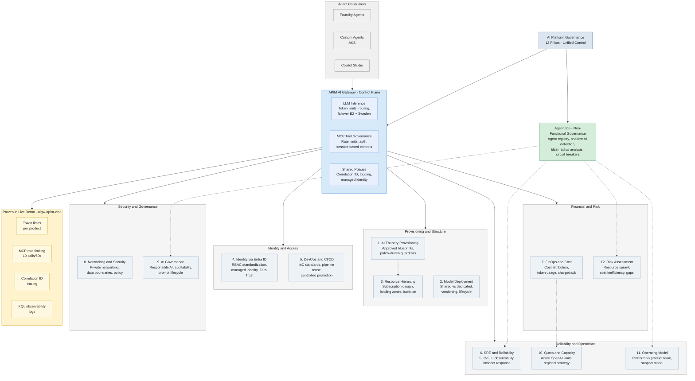

# AI Platform Governance — CDW Session 1 Findings + Architecture

*Prepared for Session 2 | March 25, 2026 | Nick San George*

> **Source material:** CDW - AI Foundry - Session 1 transcript (March 23, 2026), live demo environment (`aigw-apim-zieo`), tools-governance-plan.md, MCP_ARCHITECTURE_DRAFT.md

---

## 1. Session 1 Findings

### Attendees

| Person | Org | Focus Areas |
|--------|-----|-------------|
| **Goutham Bandapati** | Microsoft | AI Foundry architecture, landing zones, RBAC, governance |
| **Nick San George** | Microsoft | AI Foundry architecture, DR strategy, APIM AI Gateway, CI/CD, observability |
| **Jack Johnson** | Microsoft | Coordination, follow-up planning |
| **Parth Thakkar** | CDW | Platform/cloud engineering lead — requirements, cost governance, subscription design, CI/CD, operating model |
| **Ahsan** | CDW | Observability, token usage visibility, cost metrics, Datadog/Dynatrace export |
| **Sarabjeet** | CDW | Regional availability gaps, Document Intelligence in North Central, cost attribution |
| **Anuj** | CDW | Terraform, private endpoints, isolation, networking |
| **Jai** | CDW | Multiple Foundry instances vs multiple projects, management model |

### CDW's Pain Points and Asks

| Area | What CDW Raised | Implication |
|------|-----------------|-------------|
| **Regional availability** | Cannot deploy Document Intelligence in North Central (US NCD). North Central is not a "first-class" AI region. | DR and primary/secondary design constrained. Need E2 + Sweden Central strategy. |
| **Cost attribution** | Centralized Foundry subscriptions make cost splitting messy. Cannot split cost at project level today. Want token-level visibility, chargeback/showback by team/model/app, budget alerts baked in. | APIM AI Gateway solves this with `llm-emit-token-metric` + per-product cost attribution. |
| **Subscription & networking** | Already have hub-and-spoke VNets. Don't want unnecessary new subscriptions. Don't want to re-negotiate IP ranges. Questions on private endpoints, firewall rules, single Foundry bottleneck. | Can work within existing LOB subscriptions + resource groups. AI as its own spoke. |
| **Operating model** | Want clear platform vs app team separation. Platform team provisions models, guardrails, CI/CD. App teams build agents and logic. Want standardized deployment patterns (AKS vs prompt-based vs custom). | APIM as platform-team-owned gateway enforces this cleanly. |
| **Governance & RBAC** | Project-level RBAC. Preventing cross-team interference. Enforcing model choices, vector DBs, grounding rules. | Foundry projects + APIM product subscriptions = layered isolation. |
| **Observability** | Need to export telemetry to Datadog/Dynatrace. Want token usage dashboards. | App Insights as control plane signal → export pipeline to third-party tools. |

### Architecture Decisions from Session 1

| Decision | Detail | Status |
|----------|--------|--------|
| **Foundry resource model** | One Foundry resource per LOB (or per subscription), multiple projects underneath for isolation. Not one Foundry per app. **Why per-LOB matters:** Project-level tags do not flow into Azure Cost Management — all Foundry platform costs (compute, storage, managed endpoints, evaluation runs) roll up to the Foundry resource. Per-LOB Foundry = clean FinOps chargeback. **Complementary model:** APIM handles LLM inference cost tracking (tokens, model calls) via `llm-emit-token-metric` + product subscriptions, regardless of Foundry layout. Shared APIM + per-LOB Foundry gives you the best of both. | Recommended, CDW directionally aligned |
| **Subscription strategy** | Separate subscriptions recommended for greenfield, but CDW can use existing LOB subscriptions + resource groups. | Flexible — CDW decides |
| **Landing zone architecture** | AI as its own spoke in existing hub-and-spoke. Centralized networking and identity. Foundry-adjacent services (Search, Cosmos, Storage, App Insights) colocated. | Recommended |
| **DR & regional strategy** | Primary: East US 2. Secondary: Sweden Central. North Central should NOT be relied on for first-wave AI features. | Strong recommendation |
| **Observability** | App Insights as the control plane. Export to Datadog/Dynatrace. Route LLM calls through APIM for token-level observability. | Recommended |
| **CI/CD & agent deployment** | Prompt-based agents preferred ($0 hosting, YAML/SDK deployable). Custom agents on AKS follow standard patterns. Evaluation gates before prod promotion. | Recommended |
| **Session 2 topics** | AI Gateway & APIM patterns, hands-on CI/CD, cost governance in practice, mapping CDW current state to target model. | Agreed |

---

## 2. Architecture Diagram — 12 Governance Pillars

---

## 3. Pillar-by-Pillar Mapping

| # | Pillar | What It Means | How AI Gateway / APIM Addresses It | What We've Already Built / Proven | Gap / Next Step |
|---|--------|---------------|-------------------------------------|-----------------------------------|-----------------|
| 1 | **AI Foundry Provisioning** | Approved blueprints and policy-driven guardrails for standing up Foundry resources consistently. CDW asked about one Foundry per LOB vs per app. | APIM doesn't provision Foundry directly, but AI Gateway connects to Foundry and auto-routes MCP tools through APIM. Azure Policy + Bicep/Terraform blueprints enforce consistent Foundry provisioning. | AI Gateway connection proven between APIM `aigw-apim-zieo` and Foundry. Three registration paths documented and tested. | CDW needs: Bicep/Terraform templates for their Foundry + AI Gateway + APIM landing zone. Define their Foundry-per-LOB model with projects underneath. |
| 2 | **Model Deployment Strategy** | Shared vs dedicated capacity, model versioning, lifecycle management. CDW asked about prompt-based vs custom agents and cost of each. | APIM AI Gateway manages backend pools across regions (E2 primary, Sweden Central failover). Product-level TPM quotas control per-team model access. `llm-emit-token-metric` policy tracks per-model usage. | Live demo: LLM inference products (Alpha/Beta/Gamma) with per-product TPM quotas. Backend pool routing with failover. | CDW needs: Map their model catalog to APIM products. Decide shared vs dedicated PTU for high-throughput workloads. Define model versioning/promotion strategy. |
| 3 | **Resource Hierarchy & Environment Strategy** | Subscription design, isolation boundaries, landing zones. CDW has hub-and-spoke VNets, doesn't want new subscriptions. | APIM is deployed once per environment (or shared across staging/prod with product-level isolation). Foundry projects provide workload isolation within a single Foundry resource. APIM products + subscriptions scope access by team. | APIM product structure proven: LLM products per team, MCP Servers product for tool access. Environment-based policy tiers documented. | CDW needs: Map existing LOB subscriptions to Foundry resources. Decide if APIM is shared or per-environment. Define resource group taxonomy for AI services. |
| 4 | **Identity & Access via Entra ID** | RBAC standardization, managed identities, Zero Trust. CDW asked about project-level RBAC and preventing cross-team interference. | APIM validates tokens via `validate-azure-ad-token` policy. Managed identity for APIM-to-Foundry calls. Product subscriptions scope which teams access which models and tools. Agent 365 provides Entra Agent ID for agent-level identity. | Auth enforcement proven in demo: Entra ID token validation, API key-based product access, managed identity for backend calls. | CDW needs: Define RBAC matrix (platform team vs app team roles on Foundry, APIM, API Center). Implement managed identity for all agent-to-APIM calls. Plan Agent 365 Entra Agent ID rollout (GA May 2026). |
| 5 | **DevOps & CI/CD** | Enterprise IaC standards, pipeline reuse, controlled promotion. CDW uses Terraform. Asked about evaluation gates before prod. | APIM policies are code (`mcp-governance.xml`). Terraform/Bicep for APIM + Foundry provisioning. CI/CD pipeline can enforce MCP URL allowlists — only `https://<apim>.azure-api.net/*` permitted. Evaluation gates before promotion. | Policy-as-code proven: `mcp-governance.xml` in Git, applied via Terraform. CI/CD allowlist pattern documented. | CDW needs: Adapt their Terraform modules for Foundry + APIM. Build evaluation gate pipeline step. Implement MCP URL allowlist scanner in their CI/CD. |
| 6 | **SRE & Reliability** | SLO/SLI definition, observability, incident response, capacity planning. CDW asked about exporting telemetry to Datadog/Dynatrace. | APIM provides built-in App Insights integration. KQL queries for gateway logs, MCP traffic, error rates, latency. `X-Correlation-Id` for end-to-end tracing. Agent 365 adds circuit breakers and anomaly detection. | Live KQL: `ApiManagementGatewayLogs` filtering MCP operations. Correlation ID tracing proven (4/4 tests passing). Rate limit 429s include `Retry-After` header. | CDW needs: Define SLOs for AI workloads (latency, availability, token throughput). Set up diagnostic export to Datadog/Dynatrace. Build incident response runbooks for AI-specific failures (quota exhaustion, model degradation). |
| 7 | **FinOps & Cost Governance** | Cost attribution, token usage visibility, quota controls. CDW's top pain point — centralized subs make cost splitting messy. Want chargeback by team/model/app. | **Two-layer cost tracking model:** (1) APIM's `llm-emit-token-metric` emits per-request token counts — product-level subscriptions attribute LLM inference costs to teams regardless of Foundry layout. (2) Per-LOB Foundry resources give clean Azure Cost Management chargeback for Foundry platform costs (compute, storage, managed endpoints, evaluation runs) that project-level tags cannot split today. APIM + per-LOB Foundry = complete cost visibility. MCP rate limits control tool consumption. KQL queries aggregate cost by product/team/model. | Token metric emission proven in live demo. Per-product cost attribution via APIM subscription keys. Rate limiting prevents runaway tool costs. | CDW needs: Build cost dashboards (Power BI or Grafana) pulling from APIM metrics for inference AND Azure Cost Management for Foundry platform costs. Define chargeback model (per-token, per-request, or hybrid). Implement budget alerts at product level (APIM) and resource level (Foundry). |
| 8 | **Networking & Security Posture** | Private networking, data boundaries, policy enforcement. CDW has hub-and-spoke, asked about private endpoints and firewall rules. | APIM supports private endpoints, VNet integration, IP filtering policies. NSG/firewall rules restrict agent runtimes to APIM-only outbound. Network-level enforcement prevents rogue MCP server connections. | IP filtering and network-level enforcement documented. APIM deployed in Standard v2 with public endpoint (demo). | CDW needs: Deploy APIM with private endpoint in their hub-and-spoke. Configure NSGs on Foundry/AKS subnets to allow only APIM outbound. Lock down Foundry with private endpoints for all connected services. |
| 9 | **AI Governance** | Responsible AI, auditability, prompt and model lifecycle controls. CDW asked about enforcing model choices and grounding rules. | APIM policies can inspect/strip headers, enforce content safety rules. Foundry content safety filters (Purview integration). Agent 365 provides full audit trail of agent actions and tool invocations. APIM audit logs + KQL give complete request history. | Audit logging proven: every MCP call logged with method, response code, duration, correlation ID, caller IP, session. | CDW needs: Define responsible AI policy (which models allowed, content safety thresholds). Implement prompt lifecycle management (versioning, A/B testing via APIM routing). Set up Purview content safety integration on Foundry projects. |
| 10 | **Quota & Capacity Management** | Azure OpenAI limits, regional strategy, demand planning. CDW concerned about North Central limitations. | APIM backend pools manage multi-region routing (E2 + Sweden Central). `llm-token-limit` policy enforces per-product TPM caps. Priority-based routing handles capacity overflow. Batch inference for non-real-time workloads. | Multi-region backend pool proven. Per-product TPM quotas implemented. Failover routing configured. | CDW needs: Map their workloads to PTU vs PAYGO capacity. Implement demand planning dashboard. Define overflow strategy (Sweden Central as secondary, batch inference for non-urgent). Request quota increases for E2 based on projected usage. |
| 11 | **Operating Model Clarity** | Platform vs product team responsibilities, support model. CDW explicitly wants this separation. | APIM is platform-team-owned — they control policies, products, and tool registration. App teams get product subscription keys and build agents. API Center is the self-service discovery surface. Agent 365 gives platform team visibility into what app teams are doing. | Product-based isolation proven. Platform team controls policies; app teams consume via subscription keys. | CDW needs: Document RACI matrix (platform team vs app team vs security team). Define support model for AI workloads. Establish onboarding process for new app teams (get APIM subscription, access Foundry project, discover tools in API Center). |
| 12 | **Risk Assessment** | Resource sprawl, cost inefficiencies, inconsistent controls across current state. | APIM centralizes all AI traffic — no shadow APIs or rogue MCP servers in production. Agent 365 detects shadow AI usage. Cost attribution via APIM prevents untracked spending. Private tool catalog prevents tool sprawl. | Shadow detection architecture documented. Enforcement model proven (prevention + detection layers). | CDW current risks: no centralized AI gateway (traffic goes direct), no per-team cost attribution, no tool governance, regional dependency on North Central. Mitigation: implement APIM AI Gateway as the single control plane. |

---

## 4. Talking Points for Session 2

### Opening: What We Covered in Session 1

- Session 1 was foundation-setting: landing zones, subscription strategy, Foundry resource model, regional strategy, operating model
- Key decision: one Foundry per LOB with projects for isolation, E2 primary + Sweden Central secondary
- CDW's top concerns: cost attribution, operating model clarity, regional gaps, governance at scale
- Today we go deeper into the implementation layer — specifically how APIM AI Gateway addresses the governance pillars

### Pillar 1 — AI Foundry Provisioning

- **Present:** Recommended model is Foundry-per-LOB with projects underneath. Azure Policy + Bicep/Terraform blueprints for consistency.
- **New since Session 1:** We have a live APIM instance (`aigw-apim-zieo`) connected to Foundry via AI Gateway. MCP tools auto-route through APIM.
- **Ask CDW:** How many LOBs are building AI workloads today? Are they using shared or separate subscriptions? Do they have existing Azure Policy initiatives we should extend?

### Pillar 2 — Model Deployment Strategy

- **Present:** Prompt-based agents are preferred ($0 hosting). Custom agents on AKS for complex workflows. Evaluation gates before prod.
- **New since Session 1:** Live demo shows APIM managing multiple LLM products (Alpha/Beta/Gamma) with per-product TPM quotas and multi-region failover.
- **Ask CDW:** Which models are they using today? What's their PTU vs PAYGO split? Do they need batch inference for any workloads?

### Pillar 3 — Resource Hierarchy

- **Present:** CDW can use existing LOB subscriptions. AI as its own spoke in hub-and-spoke. Foundry-adjacent services colocated.
- **Ask CDW:** Can you share your current subscription topology? How many VNets are in play? Any IP range constraints we should know about?

### Pillar 4 — Identity & Access

- **Present:** APIM validates Entra tokens on every request. Managed identity for APIM-to-backend calls. Product subscriptions scope team access.
- **New since Session 1:** Agent 365 (GA May 2026) provides Entra Agent ID — each agent gets enterprise identity with lifecycle management.
- **Ask CDW:** What's their current Entra ID maturity for service principals? Are they using managed identity for existing workloads? Conditional Access policies in place?

### Pillar 5 — DevOps & CI/CD

- **Present:** CDW uses Terraform. We recommend policy-as-code for APIM governance. MCP URL allowlist in CI/CD pipelines.
- **New since Session 1:** `mcp-governance.xml` is managed as code in our repo. Applied via Terraform.
- **Ask CDW:** Can you walk us through your current Terraform module structure? Do you have existing pipeline templates we should integrate with? What's your promotion flow (dev → staging → prod)?

### Pillar 6 — SRE & Reliability

- **Present:** App Insights as the AI observability control plane. KQL queries for gateway logs. `X-Correlation-Id` for end-to-end tracing.
- **New since Session 1:** All 4 governance tests and 4 rate limit tests passing. KQL telemetry live for MCP traffic.
- **Ask CDW:** What are Datadog/Dynatrace used for today? Can we set up a diagnostic settings export? What SLOs do they want for AI workloads?

### Pillar 7 — FinOps & Cost

- **Present:** Two-layer cost tracking solves CDW's #1 pain point:
  - **Layer 1 (APIM):** `llm-emit-token-metric` gives per-request token counts. Product subscriptions attribute LLM inference costs to teams — works regardless of how many Foundry resources exist.
  - **Layer 2 (Foundry):** Per-LOB Foundry resources give clean Azure Cost Management chargeback for platform costs (compute, storage, managed endpoints, evaluation runs). Project-level tags do NOT flow into Azure Cost Management today, so the Foundry resource IS the cost boundary.
  - **Together:** APIM tracks inference costs per team. Per-LOB Foundry tracks platform costs per LOB. Both feed into a unified cost dashboard.
- **New since Session 1:** MCP rate limiting prevents runaway tool costs (10 calls/60s for `tools/call`, 60/60s for `tools/list`). Per-session counters proven.
- **Ask CDW:** What's their current cost visibility gap? Do they have a FinOps team or tooling in place? What chargeback granularity do they need (team, app, model, or all three)?

### Pillar 8 — Networking & Security

- **Present:** APIM supports private endpoints, VNet integration, IP filtering. NSG rules restrict outbound to APIM only.
- **Ask CDW:** Is the expectation that Foundry and all AI services are private-endpoint only in production? Any compliance requirements (FedRAMP, HIPAA) affecting networking choices?

### Pillar 9 — AI Governance

- **Present:** APIM provides full audit trail. Foundry has content safety filters. Agent 365 adds shadow AI detection.
- **New since Session 1:** MCP governance demo is live — every tool invocation logged with method, response code, duration, correlation ID, caller IP.
- **Ask CDW:** Do they have a responsible AI policy today? Who owns it? Are they planning to use Purview for content safety?

### Pillar 10 — Quota & Capacity

- **Present:** E2 primary, Sweden Central secondary. North Central not recommended for first-wave features.
- **Ask CDW:** What Azure OpenAI models and TPM quotas do they have today? Any capacity constraints they're hitting? Planning for GPT-5.1 or sticking with 4o series?

### Pillar 11 — Operating Model

- **Present:** Platform team owns APIM, policies, tool registration. App teams get subscription keys and build agents. API Center is self-service discovery.
- **Ask CDW:** Who is the platform team today? How many app teams are building AI workloads? Is there a CoE (Center of Excellence) structure?

### Pillar 12 — Risk Assessment

- **Present:** Current state risks identified in Session 1: no centralized gateway, no per-team cost attribution, no tool governance, regional dependency on North Central.
- **New since Session 1:** We can demonstrate what "governed" looks like — live APIM with MCP governance, rate limiting, audit logging, and correlation ID tracing. This is the "before vs after" story.
- **Ask CDW:** What's keeping them up at night? Where have they had incidents related to ungoverned AI usage? Any compliance audits coming up that need AI governance controls?

### The MCP Governance Demo — What's New

Since Session 1, we've built and proven:

| Capability | Evidence |
|------------|----------|
| MCP server registration in APIM | `microsoft-learn` registered, 3 registration paths documented |
| Session-based rate limiting | `tools/call` at 10/60s, `tools/list` at 60/60s, 4/4 tests passing |
| Governance policy as code | `mcp-governance.xml` in repo, applied via Terraform |
| End-to-end tracing | `X-Correlation-Id` on every response, KQL queries live |
| Multi-agent-type support | Same APIM endpoint serves Foundry, custom, and Copilot Studio agents |
| API Center auto-sync | MCP registrations auto-sync to discovery catalog |

**Where APIM vs Foundry tool registry fits CDW's asks:**
- CDW wants control beyond what Foundry provides natively — APIM gives them auth, rate limits, audit logging for ALL agent types, not just Foundry
- CDW wants a self-service discovery surface — API Center portal + VS Code extension
- CDW wants to prevent shadow AI — Agent 365 detects unapproved tool usage, APIM network controls prevent rogue connections
- CDW wants cost attribution at the team level — APIM product subscriptions + token metrics

### Closing: Recommended Next Steps for CDW

| # | Action | Effort | Owner |
|---|--------|--------|-------|
| 1 | Share subscription topology and VNet design | 1 hour | CDW (Parth/Anuj) |
| 2 | Define LOB-to-Foundry mapping (which LOBs, how many projects) | Half day | CDW + Microsoft |
| 3 | Deploy APIM AI Gateway in CDW's environment (pilot subscription) | 1-2 days | Microsoft (Nick/Goutham) |
| 4 | Register first MCP server through APIM, apply governance policy | 2 hours | Microsoft (live walkthrough) |
| 5 | Set up cost attribution dashboard (APIM metrics → Power BI) | 1 day | Joint |
| 6 | Define RACI matrix for platform vs app team responsibilities | Half day | CDW + Microsoft |
| 7 | Plan Agent 365 rollout for GA (May 2026) | TBD | Joint after GA |
