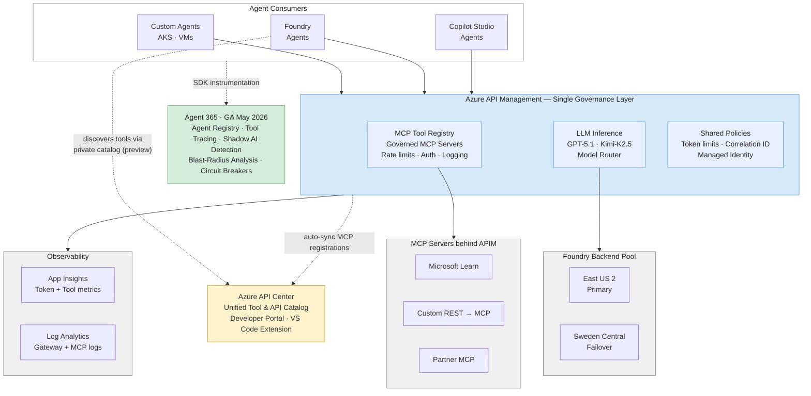
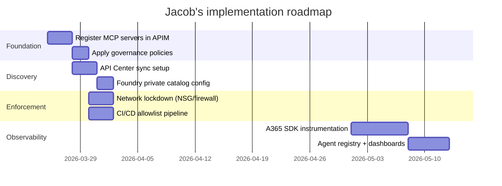

# MCP Tool Governance — Architecture for Jacob

*Draft for customer meeting | Last updated: 2026-03-24 | Status: Working draft*

> **Context:** Jacob is building a consolidated tool governance layer across custom agents, Foundry agents, and SaaS agents (Copilot Studio). He's accepted APIM as the control plane. This document maps his specific asks to architecture decisions and proven capabilities.

---

## 1. Architecture diagram



**How to read this:**

| Layer | What it does | Who owns it |
|-------|-------------|-------------|
| **Agent Consumers** (top) | Foundry, custom, Copilot Studio — all hit the same gateway | App teams |
| **APIM** (center) | Single governance layer for both LLM inference AND tool calls | Platform team |
| **Backends** (below APIM) | Foundry models, MCP servers — the actual services being governed | Model team / tool owners |
| **Observability** | Metrics + logs for both LLM and MCP traffic | Platform team |
| **API Center** (discovery) | Discovery surface — developers find and browse tools here. Auto-syncs from APIM. | Platform team |
| **Agent 365** (bottom) | Non-functional governance — identity, tracing, compliance | Security / IT |

---

## 2. Jacob's asks → Architecture answers

| # | Jacob's Ask (verbatim) | Architecture Answer |
|---|---|---|
| 1 | "Trying to think through an effective tool call registry approach. Delineating between APIM native MCP server registry and the strategy around Foundry." | APIM + API Center is the **authoritative registry**. Foundry consumes from API Center via private tool catalog (preview). Foundry is a consumer of the registry, not the owner. APIM owns registration; API Center owns discovery; Foundry sees what RBAC allows. |
| 2 | "Believe I could leverage both. But seems like combining or surfacing via APIM would be the easiest?" | Correct. APIM is the single pane for registration + policy. API Center auto-syncs from APIM. Foundry's `Build > Tools` pulls from API Center. One registration → three surfaces. |
| 3 | "Not sure your thoughts on exposing that existing managed tool call registry from Foundry into APIM, AI gateway?" | The flow is APIM → API Center → Foundry, not Foundry → APIM. When AI Gateway is connected, new MCP tools created in Foundry auto-route through APIM (endpoint rewrite). Existing Foundry-native tools (SharePoint, code interpreter) don't route through the gateway yet (March 2026 limitation). |
| 4 | "Real goal is to just build a consolidated view for users and give them a chat experience to enable those tools from custom platforms and also my managed Microsoft landscape." | API Center portal is the consolidated view. Developers browse one catalog — MCP servers, REST APIs, tool metadata — regardless of origin. VS Code extension installs tools directly. Chat experience = Foundry agents or Copilot consuming governed tools from APIM. Same URL, same policies, any agent runtime. |
| 5 | "Because I still have obvious issues with 'build your own agent' type thing in Foundry natively today. Just no real control beyond Copilot Studio-esque building." | This is exactly why APIM-first wins. Foundry's native governance is limited (no per-tool rate limiting, preview auth, Foundry-only scope). APIM gives you auth, rate limits, IP filtering, audit logging — for ALL agent types, not just Foundry. Foundry agents still work fine; they just call APIM instead of calling tools directly. |
| 6 | "How do we support all three buckets cohesively?" (custom, Foundry, SaaS) | All three agent types → APIM gateway → governed tools. Same policies, same logging, same rate limits. API Center gives all three the same discovery surface. Agent 365 (GA May 2026) gives you a unified agent registry across all three types with tool usage tracing, blast-radius analysis, and shadow AI detection. |
| 7 | "For agent ID creation, is there a easy way to do that?" | Agent 365 provides **Entra Agent ID**. Each agent gets an enterprise identity — treated like a user with lifecycle management, access control, and licensing. Agents auto-register when instrumented with the A365 SDK (Python/.NET/JS). For Foundry agents, identity is handled by the Foundry resource's managed identity. |
| 8 | "Gotcha, so force HTTP through AI gateway/Foundry. Can do." | Yes. Network controls (NSG/firewall) restrict outbound from agent runtimes to APIM only. Even if a developer hardcodes a rogue MCP URL, the network blocks it. APIM handles auth, rate limits, and logging transparently. The agent doesn't know it's governed. |

---

## 3. APIM vs Foundry tool registry comparison

| Capability | APIM + API Center | Foundry Native | Winner |
|---|---|---|---|
| **Tool registration** | ✅ Portal + REST API + Terraform | ✅ Portal only | APIM |
| **Cross-platform consumption** | ✅ Any agent type (Foundry, custom, Copilot Studio, third-party) | ❌ Foundry agents only | APIM |
| **Rate limiting** | ✅ Per-session, per-method (`tools/call` vs `tools/list`) | ❌ Not available | APIM |
| **Auth enforcement** | ✅ Entra ID, OAuth 2.1, API keys, managed identity | ⚠️ Preview | APIM |
| **Discovery** | ✅ API Center portal + VS Code extension + Foundry tool catalog | ✅ Foundry `Build > Tools` | Tie |
| **Audit logging** | ✅ Azure Monitor + App Insights + KQL + X-Correlation-Id | ⚠️ Limited | APIM |
| **Lock-down to approved tools** | ✅ RBAC + network controls + product subscriptions | ⚠️ Preview (private catalog) | APIM |
| **Content safety** | ✅ Header stripping, payload inspection policies | ⚠️ Purview integration (preview) | APIM |
| **Tool-level access control** | ✅ Products + subscriptions scope which teams access which tools | ⚠️ RBAC on catalog (preview) | APIM |
| **Network-level enforcement** | ✅ IP filtering, NSG integration | ❌ | APIM |
| **CI/CD integration** | ✅ Policy-as-code, Terraform, Bicep | ❌ Portal-only | APIM |
| **Cost tracking** | ✅ `llm-emit-token-metric` + request metrics per tool | ⚠️ Preview | APIM |
| **Foundry-native tool support** | ⚠️ New MCP tools only (no SharePoint, code interpreter yet) | ✅ Full native support | Foundry |
| **Zero-config for Foundry agents** | ❌ Requires AI Gateway connection | ✅ Built-in | Foundry |

**Bottom line:** APIM wins for governance. Foundry wins for "just works with Foundry." The architecture uses both: APIM for governance, Foundry for agent runtime. They're complementary.

---

## 4. The enforcement model

```
PREVENTION (hard enforcement)
├── Foundry: Private tool catalog + RBAC lockdown
│   └── Only approved tools visible in Build > Tools
│   └── Tool Contributor role restricted to platform team
├── Network: NSG/firewall → outbound only to APIM
│   └── Even rogue MCP URLs in code get network-blocked
├── APIM: Auth, rate limits, IP filtering, subscription scoping
│   └── No subscription key = no access
├── Pipeline: Allowlist scan in CI/CD
│   └── Only https://<your-apim>.azure-api.net/* permitted
└── GHCP: Enterprise admin MCP server policy
    └── Org-level allowlist for GitHub Copilot MCP servers

         ↓ some things get through ↓

DETECTION (soft enforcement)
├── Agent 365: Shadow AI detection
│   └── Entra Internet Access flags unregistered tool usage
├── Agent 365: Tool usage tracing
│   └── Every invocation traced — approved or not
├── Agent 365: Anomaly → automated circuit breaker
│   └── Pause agents across services on anomaly
└── APIM logs: Unrecognized endpoint alerts
    └── KQL queries catch calls to non-catalog tools
```

### By agent type

| Agent Type | Prevention | Detection | Lockdown Level |
|---|---|---|---|
| **Foundry agents** | Private tool catalog + RBAC + network NSG + AI Gateway auto-route | A365 SDK tracing + shadow detection | 🟢 Lockable |
| **Custom agents (AKS/VMs)** | CI/CD allowlist scan + network policy + A365 SDK requirement | A365 shadow detection + APIM log alerts | 🟡 Pipeline-enforced |
| **Copilot Studio** | Built-in connector governance + APIM subscription scoping | A365 agent registry | 🟢 Lockable |
| **GitHub Copilot** | Enterprise admin MCP server policy (org-level) | N/A (enterprise admin controls) | 🟢 Lockable |

### Recommended governance model by environment

| Environment | Prevention | Detection | Approach |
|---|---|---|---|
| **Sandbox / Dev** | Minimal — let developers experiment | A365 SDK recommended, not required | Bottom-up with guardrails |
| **Staging** | Pipeline scans, network controls | A365 SDK required, full tracing | Validate before production |
| **Production** | Full lockdown: private catalog, RBAC, NSG, pipeline allowlist | A365 SDK mandatory, circuit breakers armed, shadow AI detection | Top-down enforcement |

---

## 5. What we've built and proven

### Live environment

| Component | Resource | Status |
|---|---|---|
| APIM instance | `aigw-apim-zieo` (Standard v2, East US 2) | ✅ Deployed |
| MCP server | `microsoft-learn` registered in APIM | ✅ Live |
| Governance policy | `mcp-governance.xml` applied | ✅ Active |
| API Center | Deployed alongside APIM | ✅ Syncing |

### Governance policy in production

Rate limits applied per MCP session:

| MCP Method | Rate Limit | Counter Key |
|---|---|---|
| `tools/call` (write) | **10 calls / 60 seconds** | `tc\|` + `Mcp-Session-Id` |
| `tools/list` (read) | **60 calls / 60 seconds** | `rd\|` + `Mcp-Session-Id` |

Every response includes `X-Correlation-Id` for end-to-end tracing.

### Test results: 4/4 governance tests passing

```
✅ connectivity     — tools/list returned 200
✅ correlation-id   — X-Correlation-Id present in response
✅ tools-list       — Returns valid MCP response with tools array
✅ independent-counters — 5 calls + 5 lists all passed (same session)

Results: 4 passed, 0 failed, 4 total
```

### Rate limit tests: 4/4 passing

```
✅ tools/call rate limit   — 429 starts at request #11 (10 passed)
✅ tools/list rate limit   — 429 starts at request #61 (60 passed)
✅ session isolation       — Different sessions have independent counters
✅ retry-after header      — 429 responses include Retry-After header

Results: 4 passed, 0 failed, 4 total
```

### KQL telemetry (live)

```kql
ApiManagementGatewayLogs
| where OperationId contains "passThroughMcp"
| project TimeGenerated, ApiId, OperationId, ResponseCode,
          DurationMs, CorrelationId, CallerIpAddress
| order by TimeGenerated desc
```

Every MCP tool invocation shows up in Log Analytics with full telemetry: response codes, duration, correlation IDs, caller IP, session info.

### APIM product structure

| Product | Purpose | Consumers |
|---|---|---|
| LLM Products (Alpha/Beta/Gamma) | GPT-5.1, Kimi-K2.5 inference | Team-based, with TPM quotas |
| **MCP Servers — Governed Tools** | MCP tool access | All agent types, with per-session rate limits |

Both product types share the same APIM instance, same policy engine, same observability pipeline.

---

## 6. Recommended next steps for Jacob

| # | Action | Effort | Dependency |
|---|---|---|---|
| 1 | **Register his actual MCP servers through APIM** — use `APIs > MCP Servers > Expose existing` for remote servers, `Expose API as MCP` for existing REST APIs | 1-2 hours per server | APIM Standard v2 deployed |
| 2 | **Set up API Center → Foundry private tool catalog sync** — configure one-way sync, assign Data Reader RBAC, set up auth under `Governance > Authorization` | Half day | API Center + Foundry resource |
| 3 | **Define governance tiers** — which tools get which rate limits. Suggested: read-heavy tools (search, list) get higher limits; write tools (create, update, delete) get stricter limits | Architecture decision | Team alignment |
| 4 | **Network lockdown in production** — NSG/firewall rules restricting outbound from agent runtimes to APIM gateway IP only | Half day | Network team |
| 5 | **CI/CD allowlist for custom agents** — pipeline scan that blocks MCP URLs not matching `https://<apim>.azure-api.net/*` | 2-4 hours | DevOps team |
| 6 | **Instrument agents with A365 SDK** — when GA (May 2026), wrap agents with OpenTelemetry-based SDK for full tool usage tracing | 1-2 days per agent | A365 GA (May 1, 2026) |

### Architecture sequence



---

## Appendix: Three registration paths

| Path | Use Case | Flow |
|---|---|---|
| **Proxy existing MCP server** | External MCP servers (Microsoft Learn, partner tools) | MCP server exists → Register in APIM → Apply policies → Sync to API Center → Agents discover |
| **Expose REST API as MCP** | Existing REST APIs that agents need as tools | REST API in APIM → `Expose API as MCP` → Each operation becomes a tool → Apply policies |
| **Foundry auto-route via AI Gateway** | MCP tools created in Foundry portal | Connect AI Gateway → Add MCP tool in Foundry → Endpoint auto-rewrites to APIM URL → Policies applied |

**Limitation (March 2026):** Path 3 only works for new MCP tools without managed OAuth. Foundry-native tools (SharePoint, code interpreter) and OpenAPI tools don't route through the gateway yet.
