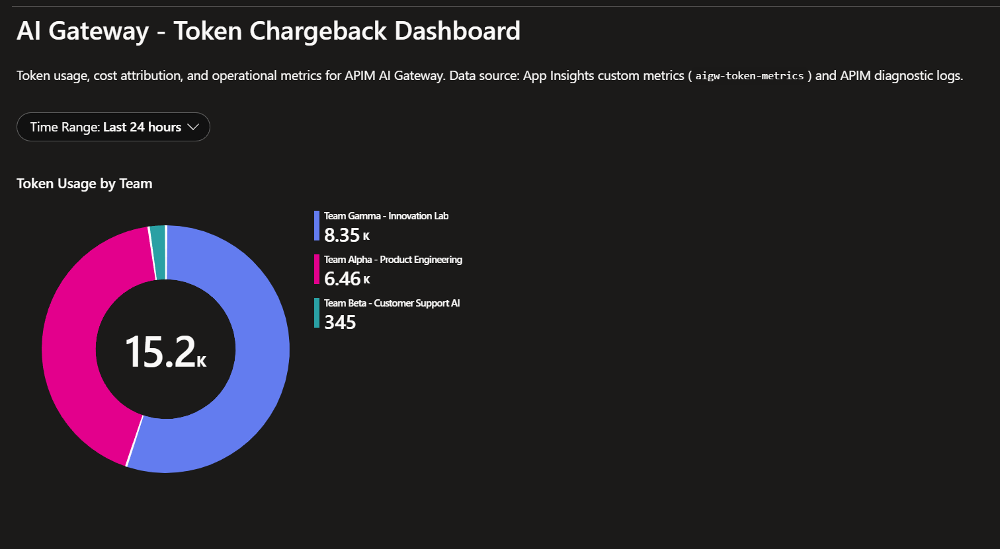
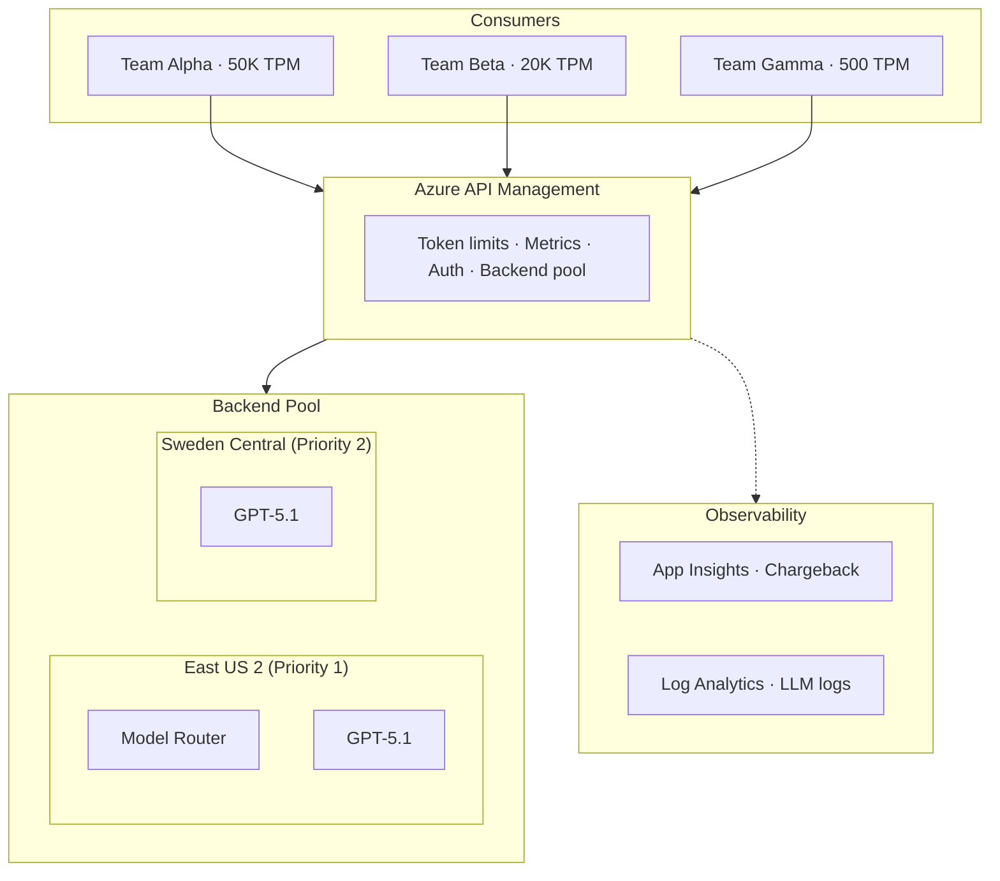

# APIM ❤️ Enterprise AI Gateway

## [Enterprise AI Gateway lab](enterprise-ai-gateway.ipynb)

[](enterprise-ai-gateway.ipynb)

Three teams share one APIM gateway with different token quotas. Multi-region Foundry backends fail over automatically with circuit breakers. MCP tools route through the same governance layer. A chargeback dashboard breaks down cost by team.

This lab composes patterns from several standalone labs into a single Terraform deployment:
[backend-pool-load-balancing](../backend-pool-load-balancing/), [token-rate-limiting](../token-rate-limiting/),
[token-metrics-emitting](../token-metrics-emitting/), [finops-framework](../finops-framework/), and
[model-context-protocol](../model-context-protocol/).

### What gets deployed

| Component | Resource | Region |
|-----------|----------|--------|
| API Gateway | Azure API Management (Standard v2) | East US 2 |
| Foundry (primary) | Cognitive Services (S0) | East US 2 |
| Foundry (failover) | Cognitive Services (S0) | Sweden Central |
| Monitoring | App Insights + Log Analytics | East US 2 |
| Identity | User-assigned managed identity | East US 2 |
| Tool catalog | API Center | East US |

### Architecture



### Prerequisites

- [Python 3.12+](https://www.python.org/) installed
- [Terraform >= 1.5](https://www.terraform.io/) installed
- [Azure CLI](https://learn.microsoft.com/cli/azure/install-azure-cli) installed
- Azure subscription with **Contributor** and **User Access Administrator** roles
- [VS Code](https://code.visualstudio.com/) with Jupyter extension

### 🚀 Get started

Proceed by opening the [Jupyter notebook](enterprise-ai-gateway.ipynb) and running cells in order.

The walkthrough covers:
1. Terraform deployment (~15 min, APIM provisioning is the bottleneck)
2. Portal import of Foundry API (enables `llm-*` policy extensions)
3. Post-deploy configuration (RBAC, diagnostics, policies)
4. LLM gateway validation (connectivity, quota enforcement)
5. MCP tool governance (optional, register MCP servers behind APIM)
6. Chargeback queries (KQL for token usage by team)

### Test suite

The lab includes 15 automated tests you can run from a terminal:

```bash
cd scripts
. .\set_env.ps1
pip install -r ..\tests\requirements.txt
.\run_tests.ps1
```

| Phase | Tests | What they validate |
|-------|-------|--------------------|
| LLM Gateway | 7 | Connectivity, Model Router, concurrent load, quota enforcement, failover, App Insights metrics, LLM logs |
| MCP Governance | 4 | Rate limits, correlation IDs, session isolation |
| MCP Rate Limit | 4 | 429 enforcement for tools/call and tools/list |

### 🗑️ Clean up resources

Use the [clean-up-resources notebook](clean-up-resources.ipynb) or run:

```bash
terraform destroy -auto-approve
```

### Lab structure

```
enterprise-ai-gateway/
├── enterprise-ai-gateway.ipynb    # Main walkthrough
├── clean-up-resources.ipynb       # Teardown
├── main.tf                        # Root Terraform config
├── providers.tf / variables.tf / outputs.tf
├── terraform.tfvars.example
├── modules/                       # 6 Terraform modules
│   ├── identity/                  # Managed identity
│   ├── monitoring/                # App Insights + Log Analytics
│   ├── foundry/                   # Cognitive Services (x2 regions)
│   ├── apim/                      # API Management
│   ├── apim-config/               # Products, subscriptions, policies
│   └── api-center/                # API Center
├── policies/                      # APIM policy XML files
├── scripts/                       # PowerShell automation
├── tests/                         # Python test suite
├── dashboards/                    # KQL queries
└── result.png                     # Expected output
```
